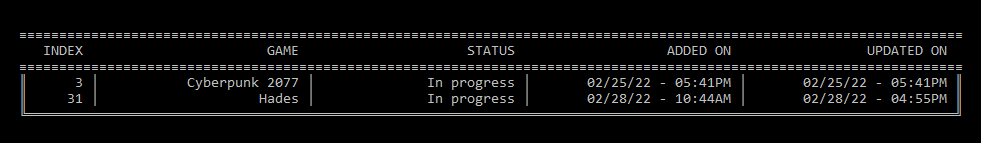

# G-Log: A CLI  backlog application for games
#### Video Demo:  <URL HERE>
 

## Description:
 

### Content
* [Motivation](#motivation)
* [Design choices](#design-choices)
* [Installation](#installation)
* [Options](#options)

### Motivation
The deep understanding of the way computers work that the first half of the course taught me, is what truly motivated me for this final project. I absolutely loved the challenging problem sets, the way C let me have control over the computer's memory and the look under the hood. There is still so much to learn on that aspect and that's why I wanted more experience with C; I wanted to "struggle" even more. My favorite problem sets were the ones working with images. And as such I decided to think up a CLI application of my own design.

One brutal truth about growing up is the lack of time one suddenly has. No longer can you spend hours on hobby's. So I noticed recently, eventhough I love playing video games, that I wasn't finishing them as much anymore. That I build myself a bit of backlog. That's what gave me the inspiration to build an application that helped me get a bit of structure in the video games I still have to play. One that can show me the games that I finished for some sense of accomplishment, but also one to show I still have a couple left to play when I want to buy a new one. So I decided to build CLI backlog system in C. 

### Design choices
One of the major design choises I faced was how to store the data. Both in terms of storing in memory as well as storing on the hard disk. One of the major functionalities of the application is the ability to dynamically grow the list of games that are on the backlog and that is an issue in C. Arrays are of a fixed length. So there was really only option here, I had to implement a linked list. To be honest, this was one of the reasons I decided to use C, because this hands on approach in terms of memory usage and speed is what teaches you the most about computers. 

Concerning the method of storing the data on the harddisk, it was less important to me than the memory part. I did try implementing a SQL solution, but it wasn't working quite the way I wanted it to and I didn't want dependencies on other libraries in my project. So I decided to write it to a simple text file, which was the perfect solution for me. It let me focus on other parts of the application.

For the application's user functionalities, I wanted to keep it simple. I know projects can quickly grow out of control in terms of scope. The basic functionalities I wanted to implement were based on simple CRUD. To see if there are any best practises for CLI applications I did some research on the internet and that's when I also added the help and version option.

### Installation
For installing the application, you will need a compiler. Also GLOGDATAPATH, which is the path to the data folder of the application will need to be added to the system variables. Lastly for simplicity sake, you can add the path to PATH for the executable file.

### Options
Below options can also be called by the '--help' command.

Usage:

  $ g-log [command] "argument"

Options:

  --add         [required argument] Adds a new game to your backlog
  --remove      [no argument] Removes a game from your backlog
  --update      [no argument] Updates the status of a game in the backlog (Backlog, In progress, Finished, Paused)
  --list        [optional argument] Lists all games in your backlog. Can search by status via arguments. No argument will show all games
  --help        Shows all options
  --version     Shows current version